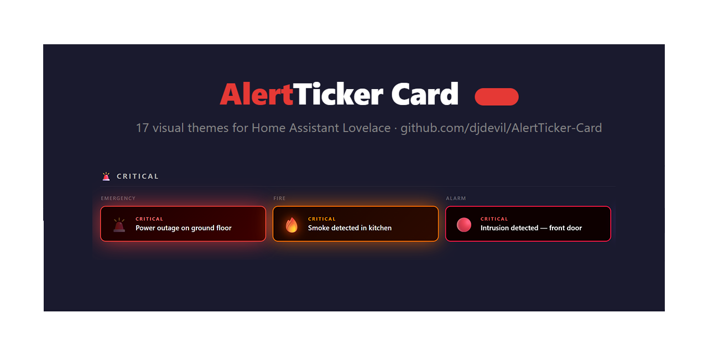
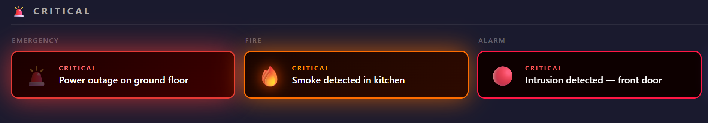
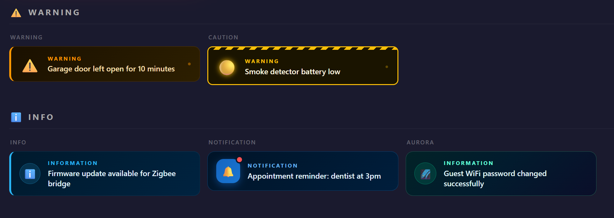

# AlertTicker Card for Home Assistant

A custom Lovelace card to display alerts and notifications based on entity states. Supports **40 visual themes** (including 4 dedicated timer themes), 12 transition animations, card interactions, entity filter, alert history, snooze, secondary entity values, timer countdown, full Jinja2 template support, vertical layout, HA global theme adaptation, **global overlay/toast notifications visible from any dashboard view**, and a complete visual editor — all without writing a single line of YAML.

[](https://github.com/custom-components/hacs)
[](https://github.com/djdevil/AlertTicker-Card)
[](https://www.buymeacoffee.com/divil17f)

[](https://my.home-assistant.io/redirect/hacs_repository/?owner=djdevil&repository=AlertTicker-Card&category=plugin)  [](https://www.buymeacoffee.com/divil17f)

---

## Community Contributors

A special thank you to **[@edwardtich1](https://github.com/edwardtich1)** for contributing the full **Russian (RU) language** translation — covering all card labels, editor UI, theme defaults, and operator names. ([#53](https://github.com/djdevil/AlertTicker-Card/issues/53))

A special thank you to **[@vdt2210](https://github.com/vdt2210)** for contributing the **Vietnamese (VI) language** translation. ([#12](https://github.com/djdevil/AlertTicker-Card/pull/12))

---

## Video Tutorial

A big thank you to **[SmartHomeJunkie](https://www.youtube.com/@SmartHomeJunkie)** for making a dedicated video about AlertTicker Card!

[](https://youtu.be/pXRYqlzeUb8)

---




---





---

## Features at a Glance

| Feature | Details |
|---------|---------|
| **Themes** | **40** visual themes in 6 categories (including 4 timer themes) |
| **Animations** | **12** selectable transition animations between alerts |
| **Per-alert theme** | Each alert has its own independent theme |
| **Multiple entities** | Unlimited alerts per card |
| **Priority system** | 4 levels — Critical, Warning, Info, Low |
| **tap_action / hold_action** | Standard Lovelace card interactions per alert |
| **Attribute triggers** | Trigger on any entity attribute (e.g. `battery_level`) |
| **AND / OR conditions** | Multiple entities must match (all or at least one) |
| **Numeric conditions** | Trigger on `>`, `<`, `>=`, `<=`, `!=` for sensor values |
| **secondary_entity** | Live entity value shown below the message |
| **Jinja2 templates** | Full HA template syntax in messages — rendered server-side with live updates |
| **entity_filter** | Text filter — one alert per matched entity, with exclude list and wildcard `*` support |
| **Snooze** | Suspend any alert — fixed duration or menu — persisted in localStorage |
| **snooze_action** | Execute a Lovelace action when the 💤 button is tapped |
| **Alert history** | 📋 button flips the card to a timestamped event log |
| **Timer themes** | 4 animated themes for `timer.*` entities with live countdown |
| **HA icons** | Use any `mdi:` icon per alert via native icon picker |
| **Sound notifications** | Per-alert audio — auto-generated tones or custom URL |
| **Large buttons** | Always-visible pill-shaped 💤 and 📋 buttons |
| **Swipe to snooze** | Swipe left on the card to snooze — no conflict with `tap_action` |
| **Vertical layout** | Stack icon on top, message below, centered — all 40 themes |
| **HA theme adaptation** | `ha_theme: true` adapts colors to any active HA global theme |
| **Overlay notification** | Global floating banner — fires from any dashboard view, with top / center / bottom position and auto-dismiss |
| **Card border** | Toggle to show the standard HA border around the card — always visible, off by default |
| **Test mode** | Force-preview all alerts in the editor regardless of conditions |
| **Visual editor** | Full GUI — no YAML required |
| **Languages** | Italian, English, French, German, Dutch, Vietnamese, Russian |
| **Performance** | Signature-based dirty check — no unnecessary re-renders |

---

## Themes

### 🚨 Critical

| Theme | Icon | Visual style |
|-------|------|-------------|
| `emergency` | 🚨 | Dark red card with pulsing red glow and flashing siren icon |
| `fire` | 🔥 | Deep orange card with flame flicker animation |
| `alarm` | 🔴 | Black card with rapid red strobe effect |
| `lightning` | 🌩️ | Dark purple card with electric glow and lightning flash |
| `nuclear` | ☢️ | Dark amber card with slowly rotating radiation symbol and radial glow pulse |
| `flood` | 🌊 | Deep blue card with animated horizontal water waves |
| `motion` | 👁️ | Dark green night-vision infrared scan effect |
| `intruder` | 🚷 | Black card with red siren flash and rotating warning icon |
| `toxic` | ☠️ | Black/green card with rising poison bubbles |

### ⚠️ Warning

| Theme | Icon | Visual style |
|-------|------|-------------|
| `warning` | ⚠️ | Dark amber card with orange left border and pulsing dot |
| `caution` | 🟡 | Black/yellow card with diagonal stripe bar and blinking dot |
| `radar` | 🎯 | Dark green card with circular sonar display, sweeping cone and concentric rings |
| `temperature` | 🌡️ | Dark orange card with shaking thermometer and animated fill bar |
| `battery` | 🔋 | Dark card with blinking battery drain animation |
| `door` | 🚪 | Dark card with swinging door animation and light ray |

### ℹ️ Info

| Theme | Icon | Visual style |
|-------|------|-------------|
| `info` | ℹ️ | Dark blue card with blue left border and circular icon wrap |
| `notification` | 🔔 | Deep navy card with blue app-icon bubble and pulsing red badge |
| `aurora` | 🌌 | Dark card with shifting aurora gradient background |
| `hologram` | 🔷 | Holographic card with grid lines, horizontal scan beam and glitch flicker |
| `presence` | 🏠 | Dark cyan card with expanding ping rings radiating from icon |
| `update` | 🔄 | Dark card with spinning double progress ring |

### ✅ OK / All Clear

| Theme | Icon | Visual style |
|-------|------|-------------|
| `success` | ✅ | Dark green card with green left border |
| `check` | 🟢 | Dark green card with pulsing ring around icon |
| `confetti` | 🎉 | Dark green card with floating coloured particles |
| `heartbeat` | 💓 | Dark card with scrolling ECG line at the bottom and beating pulse ring |
| `shield` | 🛡️ | Dark teal card with rotating scan wave and glow pulse |
| `power` | ⚡ | Dark green card with energy surge lines and lightning zap |

### 🎨 Style

| Theme | Icon | Visual style |
|-------|------|-------------|
| `ticker` | 📰 | Full-width scrolling news ticker bar with all active alerts |
| `neon` | ⚡ | Cyberpunk black card with cyan/magenta glow and scanning line |
| `glass` | 🔮 | Glassmorphism card with purple/pink gradient and frosted border |
| `matrix` | 💻 | Terminal-style green-on-black monospace card with blinking cursor |
| `minimal` | 📋 | Clean light card with dynamic accent left border |
| `retro` | 📺 | CRT amber phosphor card with scanlines, screen flicker and warm glow |
| `cyberpunk` | 🤖 | Neon purple/cyan diagonal stripes with glitch bar |
| `vapor` | 🌸 | Vaporwave perspective grid with pink/cyan gradient |
| `lava` | 🌋 | Black card with floating orange lava blobs |

### ⏱️ Timer *(only available for `timer.*` entities)*

| Theme | Icon | Visual style |
|-------|------|-------------|
| `countdown` | ⏱️ | Horizontal progress bar at the bottom that shrinks as time passes. Pulses red when < 20% remaining. |
| `hourglass` | ⏳ | Background vertical fill that drains from top to bottom, like sand in an hourglass. |
| `timer_pulse` | 💥 | Card glows with a pulsing halo — pulse speed increases as time runs out. |
| `timer_ring` | 🔵 | SVG circular ring on the right side with the countdown in the center. |

All timer themes transition green → orange → red as the remaining time decreases.

> **Note:** The `clear_theme` accepts any theme from the ✅ OK category: `success`, `check`, `confetti`, `heartbeat`, `shield`, `power`, `sunrise`, `plant`, `lock`.

---

## How It Works

### Alert lifecycle

1. Configure one or more **alerts**, each linked to an entity + condition
2. When an entity matches the condition (and any extra `conditions` rules), the alert becomes **active**
3. Active alerts are **sorted by priority** (1=most critical)
4. The card **displays** the current alert and **auto-cycles** through multiple active alerts
5. **Tap** or **hold** the card to execute configured actions
6. **Snooze** any alert with 💤 — one tap for fixed duration, or choose from the menu
7. **📋** opens the alert history with timestamps
8. When no alerts are active and `show_when_clear: true`, the card shows the **all-clear message**

### Transition animations

When multiple alerts are active, the card cycles using the selected animation:

| Animation | Description |
|-----------|-------------|
| `fold` *(default)* | 3D page-turn along the X axis |
| `slide` | Horizontal push left/right |
| `fade` | Cross-dissolve opacity fade |
| `flip` | RotateY card flip |
| `zoom` | Scale punch in/out |
| `glitch` | Clip-path jitter digital noise |
| `bounce` | Elastic spring from below |
| `swing` | RotateZ pendulum |
| `blur` | Gaussian dissolve |
| `split` | Vertical split (top up, bottom down) |
| `roll` | RotateY + translateX combined roll |
| `curtain` | Opens from center (theater curtain) |

### Secondary entity value

Display a live entity value as a second line below the alert message:

```yaml
- entity: sensor.open_zones
  operator: "!="
  state: "0"
  message: "Zones open"
  secondary_entity: sensor.open_zones_list
  secondary_attribute: zone_names   # optional — read an attribute instead of state
```

### tap_action / hold_action

Standard Lovelace interactions — tap or hold (500 ms) the whole card to trigger any action:

```yaml
- entity: binary_sensor.front_door
  state: "on"
  message: "Front door open"
  tap_action:
    action: more-info
    entity_id: binary_sensor.front_door
  hold_action:
    action: navigate
    navigation_path: /lovelace/security
```

Supported action types: `call-service`, `navigate`, `more-info`, `url`, `none`.

### Snooze

Tap 💤 on any active alert to snooze it. Two modes (configurable in General tab):

- **Menu** *(default)* — choose 1h / 4h / 8h / 24h from a menu on the card
- **Fixed duration** — configure 30min / 1h / 4h / 8h / 24h for immediate one-tap snooze

Snoozed alerts persist in `localStorage` and the card restores them automatically when the duration expires. A small amber 💤 pill appears when some alerts are snoozed while others remain active — tap it to resume all.

### snooze_action

Execute a Lovelace action when the 💤 button is tapped, in addition to snoozing. Useful for resetting sensors:

```yaml
- entity: binary_sensor.mailbox
  state: "on"
  message: "Mail arrived"
  snooze_action:
    action: call-service
    service: input_boolean.turn_off
    target:
      entity_id: input_boolean.mailbox_flag
```

### Alert history

Tap 📋 to flip the card and view a timestamped log of every alert that became active. Includes a Clear button. History is stored in `localStorage` (configurable max: 25 / 50 / 100 / 200 events).

### entity_filter

Instead of specifying a single entity, write a text filter. The card finds all entities whose ID or friendly name contains the filter text and creates one alert per match:

```yaml
- entity_filter: "battery"
  attribute: battery_level
  operator: "<="
  state: "20"
  message: "Low battery: {name} ({state}%)"
  theme: battery
  entity_filter_exclude:
    - sensor.battery_test_device
```

**Message placeholders:**

| Placeholder | Replaced with |
|---|---|
| `{name}` | Entity friendly name |
| `{entity}` | Entity ID |
| `{state}` | Current state value |

The matched entity's friendly name is also automatically shown below the message so you always know which device triggered the alert.

### HA template syntax in messages

The `message` field (and `secondary_text`) supports **full Jinja2 template syntax** — rendered server-side by Home Assistant via the WebSocket API, with live updates whenever entities change.

```yaml
# Simple sensor value
- entity: sensor.co2_ppm
  operator: ">"
  state: "1000"
  message: "CO₂: {{ states('sensor.co2_ppm') }} ppm"

# Attribute value
- entity: climate.hvac
  state: heating
  message: "Heating — room: {{ state_attr('climate.hvac', 'current_temperature') }}°"

# Conditional logic
- entity: sensor.battery_phone
  operator: "<"
  state: "20"
  message: >
    
      Critical: {{ states('sensor.battery_phone') }}%
    
      Low battery: {{ states('sensor.battery_phone') }}%
    

# Time / date
- entity: binary_sensor.night_mode
  state: "on"
  message: "Night mode active since {{ now().strftime('%H:%M') }}"

# Math / unit conversion
- entity: sensor.power_consumption
  operator: ">"
  state: "2000"
  message: "High consumption: {{ (states('sensor.power_consumption') | float / 1000) | round(2) }} kW"
```

Any template that works in HA automations and template sensors works here too.

**Editor preview:** type a filter text and a live counter shows how many entities match. Click the counter to expand a full list with names, entity IDs and current states. Click any entity to exclude it (✗) or re-include it (✓).

### Timer themes

Select a `timer.*` entity and use one of the 4 dedicated timer themes. The card reads `finishes_at` from the timer attributes and updates the display every second:

```yaml
- entity: timer.ad_blocker_paused
  state: active
  message: "Ad blocking disabled for {timer}"
  theme: countdown
```

Use `{timer}` in the message to display the live countdown (`mm:ss` or `h:mm:ss`).

When a timer entity is selected in the editor, `state` is automatically set to `active` and the theme switches to `countdown`.

### Numeric / comparison conditions

```yaml
- entity: sensor.co2_ppm
  operator: ">"
  state: "1000"
  message: "CO₂ level critical!"
```

Supported operators: `=` (default), `!=`, `>`, `<`, `>=`, `<=`.

### Attribute-based triggers

```yaml
- entity: sensor.phone
  attribute: battery_level
  operator: "<"
  state: "20"
  message: "Phone battery critical"
  theme: battery
```

### AND / OR multi-entity conditions

```yaml
- entity: binary_sensor.front_door
  state: "on"
  conditions_logic: "and"
  conditions:
    - entity: input_boolean.night_mode
      operator: "="
      state: "on"
  message: "Door open at night"
  theme: intruder
```

- `and` — all conditions must match (default)
- `or` — at least one condition must match

### HA icons (mdi:)

Enable the `use_ha_icon` toggle per alert to use a native HA icon instead of an emoji. When enabled, the icon is automatically read from the entity's attributes. You can also pick any `mdi:` or `hass:` icon from the native HA icon picker in the editor.

### Message placeholders

`{state}`, `{name}`, and `{entity}` work in the `message` field of **any** alert that has an entity set — not just `entity_filter` alerts:

```yaml
- entity: sensor.meter_abe4
  operator: "<="
  state: "20"
  message: "Battery low: {state}%"
  secondary_text: "Device: {name}"
```

### secondary_text

A static second line displayed below the message. Supports placeholders. Does not require a secondary entity:

```yaml
secondary_text: "Zone: {name} — Current: {state}"
```

### Badge customization

Hide the category badge or replace its text:

```yaml
show_badge: false        # hide completely
badge_label: "URGENT"   # or use a custom label
```

### Sound notifications

Play an audio tone when an alert becomes active. Uses the Web Audio API — no files required for the default tones:

```yaml
- entity: binary_sensor.smoke_detector
  state: "on"
  message: "Smoke detected!"
  sound: true
  sound_url: "https://example.com/alarm.mp3"  # optional custom sound
```

Default tones by category: Critical = double high beep · Warning = medium beep · Info = soft beep · OK = rising chime.

> **Note:** requires browser autoplay permission. Works out of the box on wall-mounted tablets with HA Companion.

### Large buttons

Always-visible pill-shaped 💤 and 📋 buttons — useful for wall-mounted tablets where hover is not available:

```yaml
large_buttons: true
```

### Swipe to snooze

Enable a left-swipe gesture to snooze the current alert on touch devices. Works independently of `tap_action` and `hold_action` — no conflict:

```yaml
swipe_to_snooze: true
```

Swipe at least 60 px horizontally to trigger. Uses the configured `snooze_duration` (or 1 h if none is set).

### Vertical layout

Stack the icon on top and the message below, centered — useful for narrow columns or square card grids:

```yaml
vertical: true
```

Works with all 40 themes. The **Ticker** theme keeps its horizontal scrolling. Can be combined with `ha_theme: true` and `large_buttons: true`.

### HA theme adaptation

Adapt the card's color palette to the active Home Assistant global theme:

```yaml
ha_theme: true
```

When enabled:
- Card background → `--card-background-color`
- Text → `--primary-text-color` / `--secondary-text-color`
- Critical badges/borders → `--error-color`
- Warning badges/borders → `--warning-color`
- Info badges/borders → `--info-color`
- OK badges/borders → `--success-color`

All 40 visual themes retain their animations and layouts — only the color palette adapts. Compatible with Mushroom, Material, iOS, and any custom HA theme.

### Overlay / toast notification

Enable a global floating banner that fires when a new alert triggers — **visible from any dashboard view**, not just the one where the card lives:

```yaml
overlay_mode: true
overlay_position: top     # top | center | bottom
overlay_duration: 8       # seconds before auto-dismiss (0 = manual close only)
```

How it works:
- When the card's view is **currently visible**, the banner is suppressed (no redundant notification — the card itself already shows the alert).
- When you navigate away to another view (or the card is off-screen), an independent watcher reads entity states from the always-present `<home-assistant>` element every 2 seconds and fires the banner automatically.
- A 10-second deduplication window prevents the same alert from firing twice.
- The banner is styled according to the alert category (Critical / Warning / Info / OK / Style / Timer) and dismisses automatically after `overlay_duration` seconds, or manually via the × button.

Position options:
| Value | Behavior |
|-------|----------|
| `top` | Slides in from the top of the screen |
| `center` | Pops in at the center of the screen (scale animation) |
| `bottom` | Slides in from the bottom of the screen |

### Card border

Enable a persistent visible border around the card using the standard HA border style:

```yaml
card_border: true
```

Default: `false` (off). Uses `--ha-card-border-width` and `--ha-card-border-color` from the active HA theme. Configurable via the editor toggle under 🖼️ Layout & Appearance.

### Test mode

Force all configured alerts to display as active — useful for previewing the card appearance without waiting for real conditions:

```yaml
test_mode: true
```

> Remember to remove `test_mode` before going live. A yellow banner is shown on the card as a reminder.

In the visual editor, open the **Alerts tab** → enable **Test mode** at the bottom → expand any alert to instantly preview it on the card.

---

## Installation

### Via HACS (recommended)

[](https://my.home-assistant.io/redirect/hacs_repository/?owner=djdevil&repository=AlertTicker-Card&category=plugin)

1. Click the button above **or** open **HACS → Frontend**
2. Click **⋮ → Custom repositories**
3. Add `https://github.com/djdevil/AlertTicker-Card` as type **Lovelace**
4. Find **AlertTicker Card** and click **Download**
5. **Reload** your browser

### Manual

1. Download `alert-ticker-card.js` and `alert-ticker-card-editor.js` from the [latest release](https://github.com/djdevil/AlertTicker-Card/releases)
2. Copy both files to `/config/www/`
3. Go to **Settings → Dashboards → Resources**
4. Add `/local/alert-ticker-card.js` as a **JavaScript module**
5. **Reload** the browser

---

## Visual Editor

No YAML knowledge required. The editor has three tabs:

### General tab

| Field | Description |
|-------|-------------|
| **Cycle interval** | Seconds between alerts when multiple are active (default: 5) |
| **Transition animation** | Animation played when switching alerts (12 options) — preview plays on change |
| **Show when no alerts** | Toggle to keep the card visible when everything is OK |
| **Message when clear** | Text to show in the all-clear state |
| **Theme for all-clear** | Visual theme for the all-clear card (OK themes only) |
| **Snooze behaviour** | Fixed duration or menu (30min / 1h / 4h / 8h / 24h) |
| **Show snooze bar** | Toggle the amber snooze reactivation bar |
| **Large buttons** | Always-visible pill-shaped 💤 and 📋 buttons |
| **Swipe to snooze** | Left-swipe gesture to snooze — ideal for mobile |
| **Vertical layout** | Stack icon on top, message below, centered |
| **Adapt to HA theme** | Adapt colors to the active HA global theme |
| **History max events** | How many history entries to keep (25 / 50 / 100 / 200) |
| **Fixed card height** | Lock the card height in px to prevent layout shifts |
| **Card border** | Toggle to show the standard HA border around the card (off by default) |

### 🔔 Overlay tab

| Field | Description |
|-------|-------------|
| **Enable overlay** | Toggle the global floating banner notification |
| **Position** | `Top` / `Center` / `Bottom` — where the banner appears on screen |
| **Duration** | Seconds before auto-dismiss (0 = manual close only) |

The tab shows an **ON** badge when overlay mode is active.

### Alerts tab

For each alert:

| Field | Description |
|-------|-------------|
| **Entity filter** | Text filter with wildcard `*` — auto-expands to one alert per matched entity |
| **Entity** | Single entity from your HA instance (hidden when filter is active) |
| **Attribute** | Optional — check attribute instead of entity state (dot-notation supported) |
| **Condition** | Operator + trigger value |
| **Priority** | 1 (Critical) → 4 (Low) |
| **Message** | Text shown when active — supports `{name}`, `{entity}`, `{state}`, `{timer}` |
| **Secondary text** | Static second line — supports placeholders, no entity required |
| **Secondary entity** | Live value shown below the message |
| **Theme** | Visual theme — timer entities see only timer themes |
| **Icon** | Emoji override, or native `mdi:` icon picker via toggle |
| **Badge** | Show/hide category badge or set a custom label |
| **Snooze duration** | Per-alert override of global snooze setting |
| **Sound** | Enable audio notification + optional custom URL |
| **Extra conditions** | AND/OR additional entity conditions |
| **Tap action** | Action executed on tap (native service control) |
| **Hold action** | Action executed on hold (500 ms) |
| **Snooze action** | Action executed when 💤 is tapped |

You can **reorder** alerts with ↑ / ↓ buttons.

---

## YAML Configuration

### Card-level options

| Option | Type | Default | Description |
|--------|------|---------|-------------|
| `cycle_interval` | `number` | `5` | Seconds between alerts when cycling |
| `cycle_animation` | `string` | `fold` | Transition animation |
| `show_when_clear` | `boolean` | `false` | Show card when no alerts are active |
| `clear_message` | `string` | `""` | Message shown in all-clear state |
| `clear_theme` | `string` | `success` | Theme for all-clear (`success`, `check`, `confetti`) |
| `snooze_default_duration` | `number` | *(menu)* | Fixed snooze duration in hours (`0.5`, `1`, `4`, `8`, `24`). Omit for menu. |
| `show_snooze_bar` | `boolean` | `true` | Set `false` to hide the amber snooze reactivation bar and pill |
| `large_buttons` | `boolean` | `false` | Always-visible pill-shaped 💤 and 📋 buttons |
| `swipe_to_snooze` | `boolean` | `false` | Left-swipe gesture to snooze on touch devices |
| `vertical` | `boolean` | `false` | Vertical layout — icon on top, message centered below |
| `ha_theme` | `boolean` | `false` | Adapt card colors to the active HA global theme |
| `history_max_events` | `number` | `50` | Max history entries to keep |
| `card_height` | `number` | *(auto)* | Fixed card height in px — prevents layout shifts when cycling |
| `card_border` | `boolean` | `false` | Show the standard HA border around the card at all times |
| `overlay_mode` | `boolean` | `false` | Show a floating banner when a new alert triggers — visible from any dashboard view |
| `overlay_position` | `string` | `top` | Banner position: `top`, `center`, or `bottom` |
| `overlay_duration` | `number` | `8` | Seconds before auto-dismiss (0 = manual close only) |
| `test_mode` | `boolean` | `false` | Show all alerts as active (ignore conditions) — for editor preview only |
| `alerts` | `list` | `[]` | List of alert objects |

### Alert-level options

| Option | Type | Required | Description |
|--------|------|----------|-------------|
| `entity` | `string` | ✅* | Entity ID |
| `entity_filter` | `string` | ✅* | Text filter — supports `*` wildcard (replaces `entity`) |
| `entity_filter_exclude` | `list` | ❌ | Entity IDs to exclude from filter |
| `show_filter_name` | `boolean` | `true` | Set `false` to hide the entity friendly name below the message |
| `attribute` | `string` | ❌ | Attribute to check instead of state — supports dot-notation (e.g. `activity.0.forecast`) |
| `operator` | `string` | ❌ | `=` `!=` `>` `<` `>=` `<=` (default: `=`) |
| `state` | `string` | ✅ | Trigger value |
| `message` | `string` | ✅ | Text shown when active — supports `{name}`, `{entity}`, `{state}`, `{timer}` |
| `secondary_text` | `string` | ❌ | Static second line below the message — supports `{state}`, `{name}`, `{entity}` |
| `theme` | `string` | ❌ | Visual theme (default: `emergency`) |
| `priority` | `number` | ❌ | 1–4 (default: `1`) |
| `icon` | `string` | ❌ | Emoji or `mdi:` icon override |
| `use_ha_icon` | `boolean` | ❌ | Use HA native icon instead of emoji |
| `show_badge` | `boolean` | `true` | Set `false` to hide the category badge |
| `badge_label` | `string` | ❌ | Custom text for the category badge |
| `secondary_entity` | `string` | ❌ | Entity whose live value appears below the message |
| `secondary_attribute` | `string` | ❌ | Attribute of `secondary_entity` to show — supports dot-notation |
| `snooze_duration` | `number\|null` | ❌ | Override global snooze: hours, `null` for menu, omit to use global |
| `sound` | `boolean` | `false` | Play a sound when this alert becomes active |
| `sound_url` | `string` | ❌ | Custom `.mp3`/`.wav` URL — omit for auto-generated tone |
| `conditions_logic` | `string` | ❌ | `and` or `or` for extra conditions |
| `conditions` | `list` | ❌ | Extra entity conditions |
| `tap_action` | `object` | ❌ | Action on tap |
| `hold_action` | `object` | ❌ | Action on hold (500 ms) |
| `snooze_action` | `object` | ❌ | Action executed when 💤 is tapped |

*Either `entity` or `entity_filter` is required.

### Action object (`tap_action`, `hold_action`, `snooze_action`)

| Field | Description |
|-------|-------------|
| `action` | `call-service` · `navigate` · `more-info` · `url` · `none` |
| `service` | HA service in `domain.service` format |
| `target` | `{entity_id: "..."}` |
| `service_data` | Extra service parameters (object) |
| `navigation_path` | Path for `navigate` action |
| `url_path` | URL for `url` action |
| `entity_id` | Entity for `more-info` action |

---

## Examples

### Battery monitor with entity filter

```yaml
type: custom:alert-ticker-card
cycle_animation: slide
alerts:
  - entity_filter: "battery"
    attribute: battery_level
    operator: "<="
    state: "20"
    message: "Low battery: {name} ({state}%)"
    theme: battery
    priority: 2
    entity_filter_exclude:
      - sensor.battery_test_device
```

### Timer with countdown

```yaml
type: custom:alert-ticker-card
alerts:
  - entity: timer.ad_blocker_paused
    state: active
    message: "Ad blocking disabled for {timer}"
    theme: countdown
    priority: 2
```

### Alarm with tap_action

```yaml
type: custom:alert-ticker-card
alerts:
  - entity: alarm_control_panel.home
    state: "triggered"
    message: "ALARM TRIGGERED"
    priority: 1
    theme: emergency
    tap_action:
      action: call-service
      service: alarm_control_panel.alarm_disarm
      target:
        entity_id: alarm_control_panel.home
      service_data:
        code: "1234"
```

### Smart snooze (resets the sensor)

```yaml
type: custom:alert-ticker-card
alerts:
  - entity: binary_sensor.mailbox
    state: "on"
    message: "Mail arrived"
    theme: notification
    snooze_action:
      action: call-service
      service: input_boolean.turn_off
      target:
        entity_id: input_boolean.mailbox_flag
```

### Night-time door alert (AND condition)

```yaml
type: custom:alert-ticker-card
alerts:
  - entity: binary_sensor.front_door
    state: "on"
    conditions_logic: "and"
    conditions:
      - entity: input_boolean.night_mode
        state: "on"
    message: "Front door open at night!"
    priority: 1
    theme: intruder
    hold_action:
      action: navigate
      navigation_path: /lovelace/security
```

### Multiple warnings cycling

```yaml
type: custom:alert-ticker-card
cycle_interval: 8
cycle_animation: slide
show_when_clear: true
clear_message: "All systems normal"
clear_theme: success
alerts:
  - entity: binary_sensor.smoke_detector
    state: "on"
    message: "Smoke detected in kitchen!"
    priority: 1
    theme: fire
  - entity: binary_sensor.water_leak
    state: "on"
    message: "Water leak under sink"
    priority: 2
    theme: flood
  - entity: sensor.co2_ppm
    operator: ">"
    state: "1000"
    message: "CO₂ level too high — {state} ppm"
    priority: 2
    theme: toxic
  - entity: binary_sensor.window_contact
    state: "on"
    message: "Living room window open"
    priority: 3
    theme: door
    secondary_entity: sensor.outdoor_temperature
```

---

## Languages

The card automatically detects the language from your Home Assistant settings.

| Language | Code | Fallback |
|----------|------|---------|
| Italian | `it` | — |
| English | `en` | ✅ default |
| French | `fr` | — |
| German | `de` | — |
| Dutch | `nl` | — |
| Vietnamese | `vi` | — |
| Russian | `ru` | — |

---

## Troubleshooting

**Card not appearing after installation**
- Add `alert-ticker-card.js` as a JavaScript module in Settings → Dashboards → Resources
- Hard-reload the browser (Ctrl+Shift+R / Cmd+Shift+R)

**Features not working after update (secondary text, templates, new options)**
- HA and browsers cache custom card files aggressively. After updating, always do a **hard-reload** (`Ctrl+Shift+R` / `Cmd+Shift+R`) or go to **Settings → System → Restart → Clear cache and restart**. You can verify the running version by searching for `CARD_VERSION` in the JS file via browser DevTools.

**Entity picker not showing in editor**
- Known HA lazy-loading issue. The card handles it automatically. If it still doesn't appear, close and reopen the editor.

**Card disappears when alerts resolve**
- Set `show_when_clear: true` to keep the card visible.

**Trigger state not matching**
- State values are case-sensitive exact strings. Use the live **Current state** hint in the editor or check Developer Tools → States.

**Timer not updating**
- Ensure the timer entity state is `active`. The card reads `finishes_at` from the timer attributes. If `finishes_at` is missing, the countdown shows `--:--`.

**entity_filter matching too many entities**
- Use a more specific filter text, or click individual entities in the editor preview list to exclude them.

---

## Contributing

See [CONTRIBUTING.md](CONTRIBUTING.md) for guidelines on reporting bugs, suggesting features, and contributing code.

---

## License

MIT License — see [LICENSE](LICENSE) for details.

---

## Support

If you find this card useful, consider buying me a coffee ☕

[](https://www.buymeacoffee.com/divil17f)
